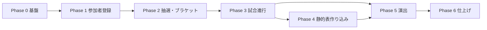

# 実装計画 — ダーツ大会 ライブ進行＆VS演出システム

> 本書は `00_REQUIREMENTS.md` のフェーズ分割を、Cursor で順番に実装できる粒度に落とし込んだマスター計画である。
> 各フェーズの詳細手順は `phase0.md` 〜 `phase6.md` を参照し、**前フェーズの Done を満たしてから次へ進む**。

---

## 1. 現状

| 項目 | 状態 |
|---|---|
| 要件定義 | ✅ `00_REQUIREMENTS.md` / `01_TECH` / `02_DESIGN` / `03_CURSOR_PROJECT_RULES` |
| Phase 0–2 実装指示 | ✅ `INSTRUCTIONS.md` |
| DB マイグレーション雛形 | ✅ `0001_init.sql`（未適用） |
| 座標計算雛形 | ✅ `layout.ts`（未配置） |
| アプリケーションコード | ✅ Phase 2 完了（Phase 3 未着手） |

---

## 2. フェーズ一覧と作業量見積もり

| Phase | 内容 | 見積もり | 成果物ドキュメント |
|---|---|---|---|
| **0** | 基盤（Vite/Supabase/Realtime） | 0.5〜1 日 | [phase0.md](./phase0.md) ✅ コード完了 |
| **1** | 参加者登録（カメラ・顔トリミング） | 1〜2 日 | [phase1.md](./phase1.md) ✅ |
| **2** | 抽選・ブラケット生成・静的トーナメント表 | 2〜3 日 | [phase2.md](./phase2.md) ✅ |
| **3** | 試合進行ロジック（勝敗・undo・同期） | 2〜3 日 | [phase3.md](./phase3.md) |
| **4** | 静的トーナメント表示の作り込み | 1〜2 日 | [phase4.md](./phase4.md) |
| **5** | 演出レイヤー（GSAP・爆発・VS） | 3〜4 日 | [phase5.md](./phase5.md) |
| **6** | 仕上げ（プリロード・キオスク・リハ） | 1〜2 日 | [phase6.md](./phase6.md) |

**合計: 約 11〜17 人日**（1 名・フルタイム想定）

> 演出（Phase 5）を土台より先に作らない。Phase 0〜3 で「正しい進行＋座標」が取れてから演出を載せる。

---

## 3. 依存関係



- Phase 4 と Phase 5 は Phase 3 完了後に並行可能だが、**Phase 5 は Phase 2 の座標が正しいことが前提**。
- Phase 4（配色・ハイライト）は Phase 5 前でも後でもよいが、演出デバッグ時は Phase 4 完了済みの方が見やすい。

---

## 4. 絶対原則（全フェーズ共通）

`03_CURSOR_PROJECT_RULES.md` より:

1. **真実源は Supabase**（`events.bracket_snapshot`）。ローカル state を真実源にしない。
2. **進行ロジックは brackets-manager に委譲**。WB/LB 遷移・GF リセットを手書きしない。
3. **座標は `computeBracketLayout` 経由**。ハードコード禁止。
4. **演出と状態更新を分離**。演出失敗で進行を壊さない。
5. **メディアはプリロード後に再生**（Phase 5 以降）。
6. **表示端末は Chrome 固定**。クロスブラウザ対応はしない。

---

## 5. 技術スタック（確定・変更禁止）

| 領域 | 採用 |
|---|---|
| フロント | React 18 + Vite + TypeScript(strict) + Tailwind |
| BaaS | Supabase（DB / Storage / Realtime） |
| 進行 | brackets-manager + brackets-memory-db |
| 演出 | GSAP / PixiJS / lottie-web（Phase 5 で導入） |
| 顔検出 | @mediapipe/face_detection |
| テスト | Vitest |
| デプロイ | Vercel |

---

## 6. ディレクトリ構成（最終形）

```
src/
  routes/           AdminPage, DisplayPage, RehearsalPage
  features/
    registration/   Phase 1
    draw/           Phase 2
    bracket/        Phase 2–4（manager, layout, BracketView）
    progression/    Phase 3
    presentation/   Phase 5
  lib/              supabase, realtime, media
  types/
  assets/           Phase 5 以降
supabase/migrations/0001_init.sql
```

---

## 7. 実装の進め方（Cursor 向け）

1. 作業開始時に **該当 phaseN.md を `@` 参照**して Cursor に指示する。
2. フェーズ内のタスクは **番号順**に実装する。
3. 各フェーズ末尾の **Done チェックリスト**をすべて ✅ にしてから次フェーズへ。
4. `npx vitest run` が通る状態を維持する（Phase 2 以降）。
5. 不明点は推測で進行ロジックや座標を埋めず、要件書を確認する。

### 推奨 Cursor プロンプト例

```
@phase2.md @03_CURSOR_PROJECT_RULES.md @layout.ts
Phase 2 のタスク 2.3〜2.5 を実装してください。Done チェックリストまで確認してください。
```

---

## 8. 参照ドキュメント

| ファイル | 用途 |
|---|---|
| `00_REQUIREMENTS.md` | 全体要件・フェーズ Done 定義 |
| `01_TECH_REQUIREMENTS.md` | 技術詳細・データモデル |
| `02_DESIGN_REQUIREMENTS.md` | UI/演出デザイン |
| `03_CURSOR_PROJECT_RULES.md` | AI ガードレール |
| `INSTRUCTIONS.md` | Phase 0–2 の詳細コード雛形 |
| `0001_init.sql` | DB スキーマ |
| `layout.ts` | 座標計算雛形 |

---

## 9. 完成の定義（プロジェクト全体）

- [ ] 当日、運営が `/admin` だけで大会を最初から最後まで完走できる
- [ ] 試合確定で「線衝突 → 爆発 → VS 画面」が座標駆動で再生される（スキップ可）
- [ ] ダブルイリミの勝敗・LB 落とし・GF リセットが 100% 正しい（Vitest 担保）
- [ ] 操作端末・表示端末ともリロードで状態復元できる
- [ ] リハーサルモードで本番と同条件の通しが成功する
